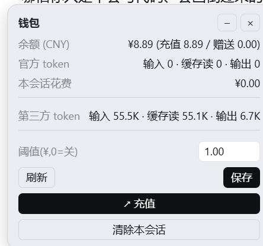
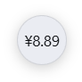
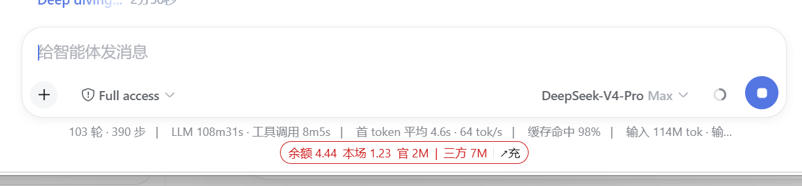
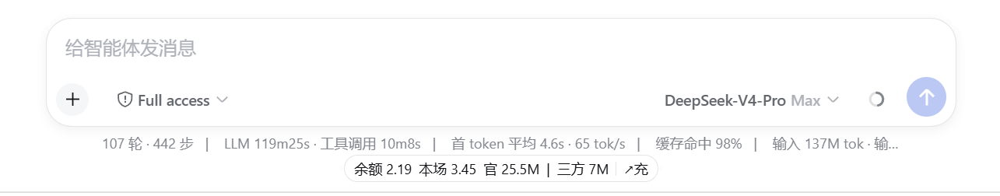

# DeepSeek Harness Balance Monitor & Recharge Plugin

### 余额监控和充值插件

<p align="center">
  <a href="../../README.md">English</a> ·
  <a href="./README.zh-CN.md">简体中文</a>
</p>

<p align="center">
  
  
  
</p>

**DeepSeek Harness Web 的多供应商钱包标签。**

输入框旁一行常驻标签：官方 DeepSeek 的（余额、本会话花费、token、一键充值、低余额提醒）与第三方合计 token，按供应商分桶记账，永不错位——GLM 会话不会显示 DeepSeek 的余额，DeepSeek 的账单不会拿 GLM 的 token 来算。

<p align="center">
  如果 dsh-wallet 帮到了你，请考虑点一个 ⭐ Star，谢谢！
</p>

## 显示什么

```
余额 5.89 · 本场 0.72 · 官 18.8M | 三方 800K · ↗充
```

- **官方 DeepSeek**——余额（60 秒全局刷新 + 启动快速重试）、本会话花费（官方价格时间线计价，含 2026-08-17 峰谷价）、token 拆分。
- **第三方合计**——本会话 token（输入 / 缓存读 / 输出）。不算钱、不猜余额、零配置。
- **点开面板**——币种余额拆分、花费与 token 明细、可自由填写的低余额阈值（两位小数、全局持久化）、手动刷新、跳转官方充值页（首次点击显示域名确认，防钓鱼）。
- **悬浮窗口**——从面板切出可自由拖动的悬浮钱包窗口（位置跨刷新记忆），或最小化为小圆点；低于阈值时圆点变红。
- **低余额提醒**——低于阈值时标签变红呼吸 + 桌面通知一次，余额回升后自动复位。
- **跟随主题**——全部使用 `--dsw-alias-*` 主题变量，浅色/深色主题自动适配；面板点外部自动关闭，靠边自动反向展开。
- **清除本会话**——一键只清当前对话的 token/花费记录，其他对话不受影响。

### 截图

| 悬浮窗口（可拖动） | 最小化圆点 | 低于阈值（提醒中） | 高于阈值（正常） |
| --- | --- | --- | --- |
|  |  |  |  |

## 安装

```sh
dsh plugin --profile web add github:feibi-mochi/deepseek-harness-wallet
```

重启 `dsh web`，然后强制刷新页面。

## 数据与安全

| 项目 | 行为 |
| --- | --- |
| Token 计费 | 监听 `llm/stream` 事件，按 provider 分桶（`deepseek-official` 之外全部归第三方）、按会话隔离，多开会话互不串账。 |
| 余额 | 凭证库 `DEEPSEEK_API_KEY` 只在本机流转，仅作为 `Authorization` 头发往官方 `/user/balance` 接口。 |
| 会话日志 | 插件不写入任何事件；数据存于 `$DSH_HOME/storages/wallet.json`。 |
| 模型可见性 | 不注册工具、不注入提示词、零 token 消耗。 |
| 充值 | 地址硬编码为官方 `https://platform.deepseek.com/top_up`，不可配置（防钓鱼）。 |

## 价格时间线

CNY/百万 token，整理自官方公告（缓存写入不计费）：

- 2025-02-09 起——deepseek-chat 2/8（缓存读 0.5）、deepseek-reasoner 4/16（缓存读 1）
- 2026-05-22 起——v4-flash 1/2（缓存读 0.02）、v4-pro 3/6（缓存读 0.025）
- 2026-08-17 起——峰谷价（北京 9:00–12:00 / 14:00–18:00 为高峰）

## Roadmap

- [ ] 第三方价格表（按 token 折算花费）
- [ ] 余额历史曲线
- [ ] 更多供应商的余额接口适配（如智谱）

## License

[MIT](../../LICENSE)
